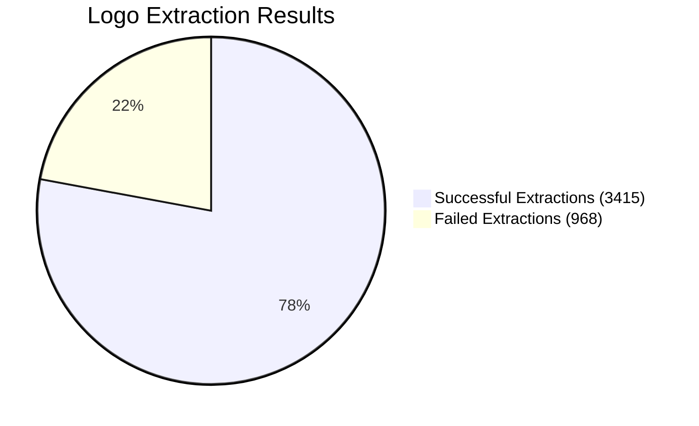
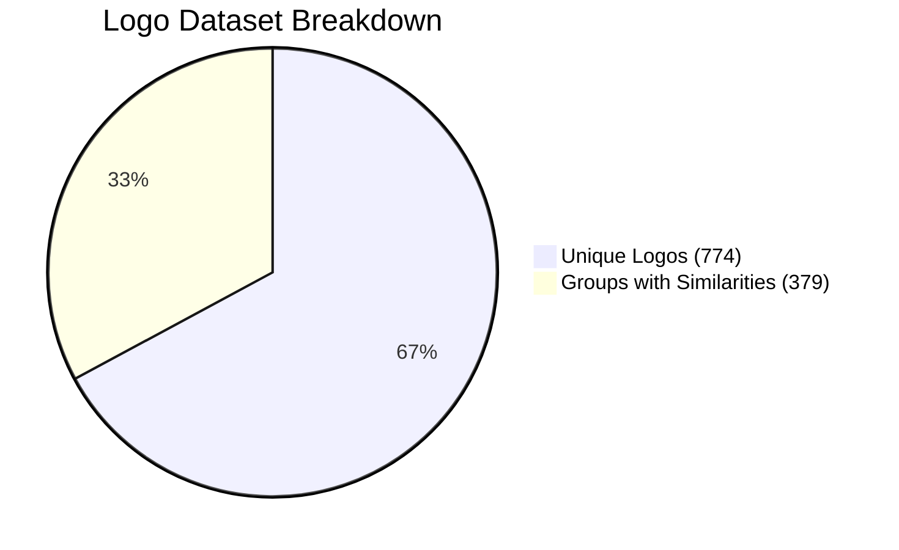
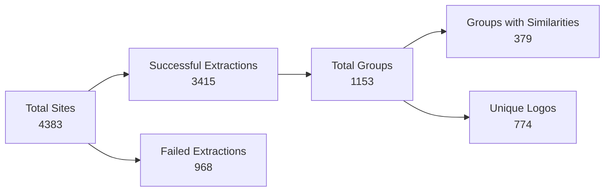
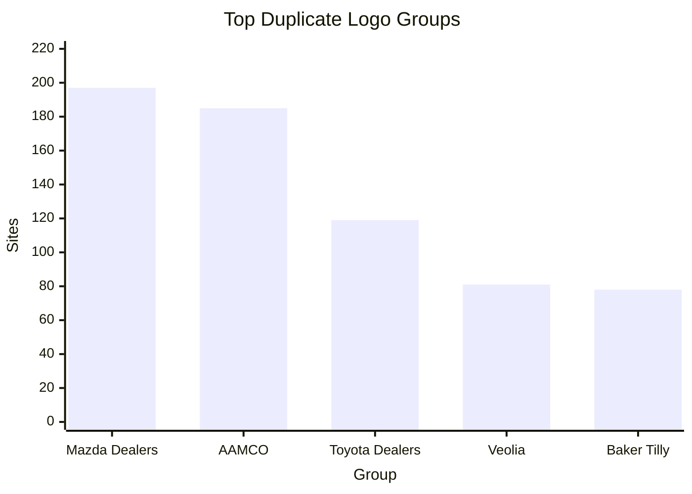

    


# Logo Extract & Grouping
This repository contains a Node.js tool designed to crawl a list of websites, extract their logos, and group them based on visual similarity. It uses perceptual hashing to identify sites that share the same logo, even if the files are different. The primary output is a YAML file containing the grouped sites and a dynamically generated statistical report in the README.

## How It Works

The engine follows a multi-step process to efficiently analyze and group thousands of websites:

1.  **Input**: The process starts with a list of domains provided in `sites.csv`.
2.  **Crawling**: The script processes the websites in parallel, with a configurable concurrency limit to manage resources and avoid rate-limiting.
3.  **Logo Extraction**: For each site, it attempts to find the logo URL using a tiered approach:
    *   **Tier 1 (Metadata)**: It first checks for high-quality logo definitions like `apple-touch-icon` and `og:image`.
    *   **Tier 2 (DOM Heuristics)**: If no metadata is found, it falls back to searching the HTML for `` tags with attributes like `class="logo"`, `id="logo"`, or `alt="logo"`.
4.  **Hashing**: Once a logo URL is found, the image is downloaded. Using the `sharp` library, it is converted to a standardized 9x8 grayscale image. A [Difference Hash (dHash)](https://www.hackerfactor.com/blog/index.php?/archives/529-Kind-of-Like-That.html) is then generated from these pixels. This hash represents the visual characteristics of the logo.
5.  **Grouping**: The script compares the hashes of all successful extractions using the Hamming distance. Logos with a hash distance below a defined similarity threshold are placed into the same group.
6.  **Output**: The results are saved into two main files:
    *   `groups.yaml`: Contains a detailed list of all groups, including the site URL, logo URL, and perceptual hash for each member of the group.
    *   `stats.json`: A statistical report is generated, providing an overview of the latest run.

## Repository Structure

-   `index.js`: The main script that runs the entire extraction and grouping process.
-   `sites.csv`: The input file. A plain text list of website domains to be processed.
-   `groups.yaml`: The primary data output file containing the logo groups.
-   `package.json`: Lists all project dependencies.
-   `stats.js`: A helper module that generates the statistical markdown report from the `groups.yaml` data.
-   `debug.js`: A utility script to analyze websites that failed the initial extraction, providing a detailed step-by-step diagnostic log.

## Usage

### Prerequisites

-   Node.js
-   npm (Node Package Manager)

### Installation

Clone the repository and install the required dependencies:
```bash
git clone https://github.com/andreilazu/logo_extract.git
cd logo_extract
npm install
```

### Running the Extractor

1.  Populate `sites.csv` with the domains you wish to analyze, one per line.
2.  Run the main script from your terminal:

```bash
node index.js
```

The script will begin processing the sites, showing progress in the console. Upon completion, `groups.yaml` will be created/updated, and the `README.md` will be overwritten with the new statistical report.

### Debugging Failed Extractions

If some sites fail the extraction process, you can use the `debug.js` script to investigate them individually. The script automatically identifies which sites from `sites.csv` are not present in `groups.yaml` and runs a detailed analysis on them.

```bash
# Analyze the first 5 failed sites
node debug.js

# Analyze the first 20 failed sites
node debug.js 20
```


## 💡 Key Insights

- **Duplicate Detection Rate:** 32.87% of groups contain duplicates
- **Average Group Size:** 2.96 sites per group
- **Largest Group:** 197 identical logos found
- **Efficiency:** Found 2262 duplicate logo instances across 379 groups

---

*Generated by Logo Grouping Engine • 1/29/2026, 5:09:59 PM*
