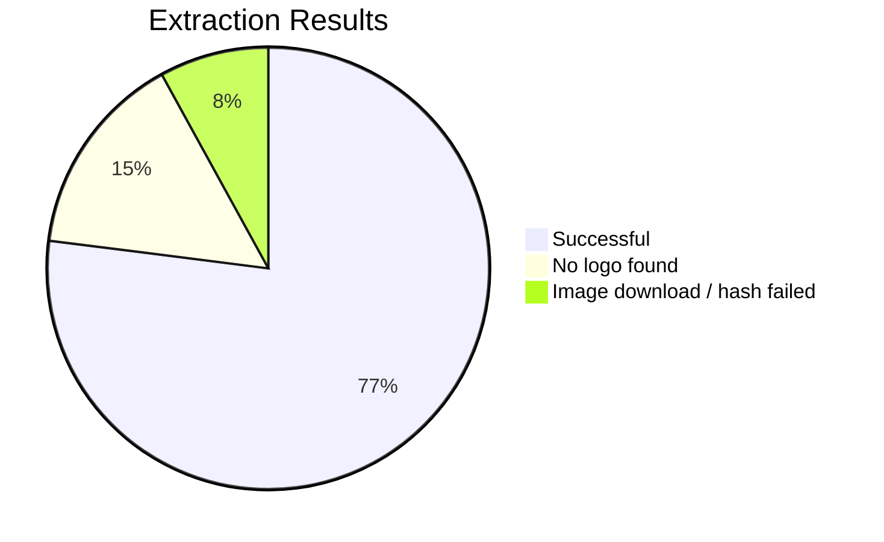
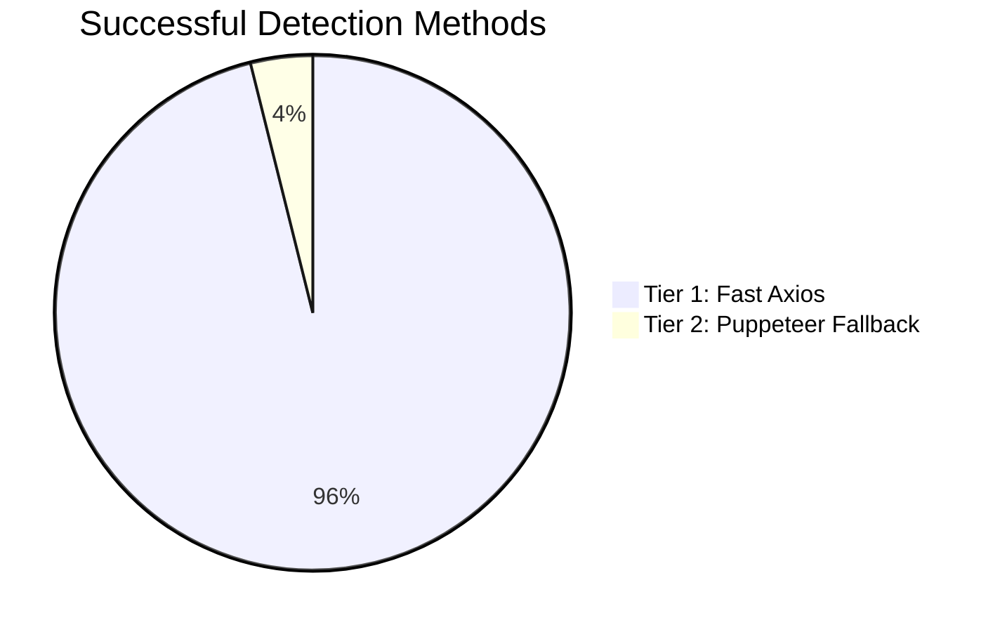

### 📊 Performance & Reliability (sample run – 2026-01-29)

> ⏱️ Duration: **32.4 s**  
> Sites tested: **100**

#### Extraction Success Rate

#### Which method actually found the logo?

> **Note:** Tier 1 = fast static parse (axios + cheerio)  
> Tier 2 = JavaScript-rendered fallback (Puppeteer)
